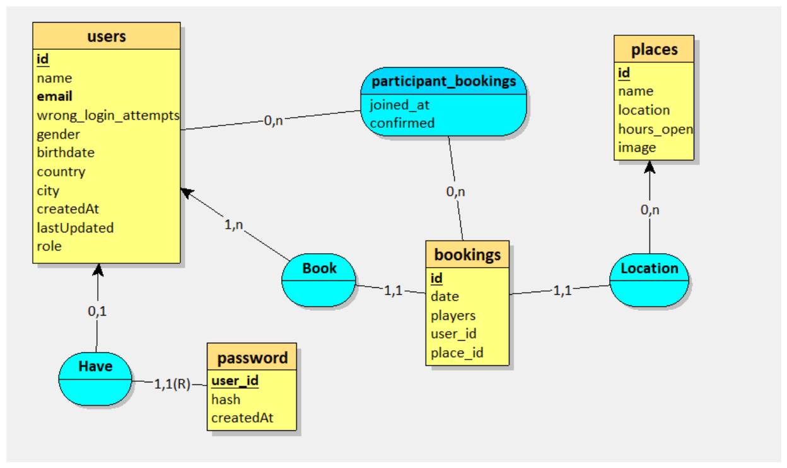
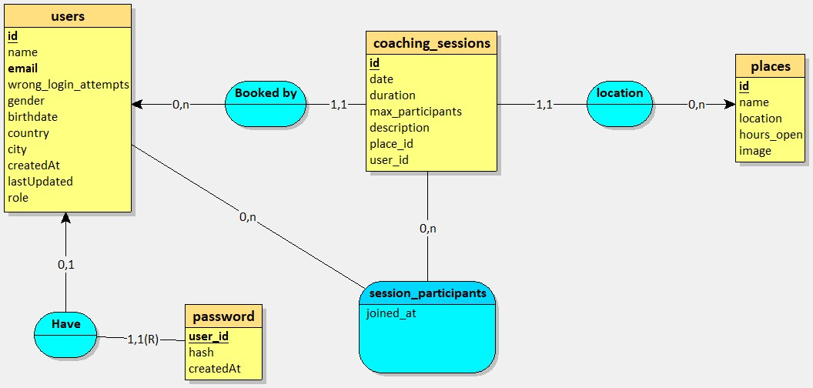
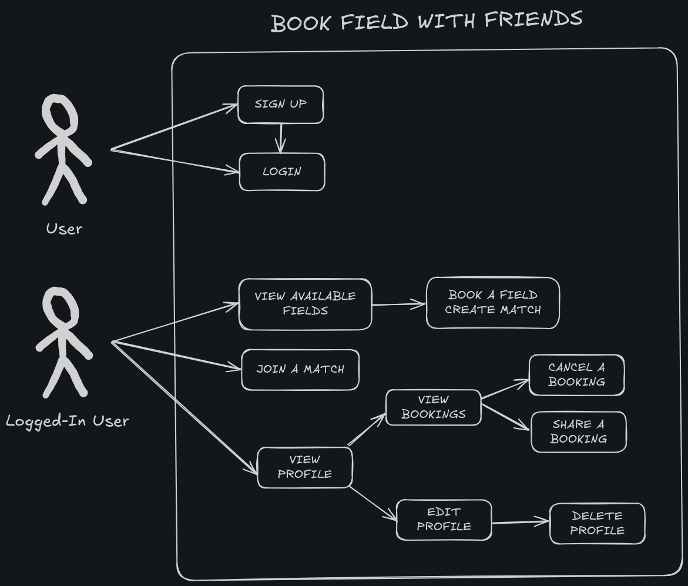

# Projets BTS SIO SLAM - Épreuve E5

Ce dépôt contient les deux projets développés dans le cadre de l'épreuve E6 du BTS SIO option SLAM.

## Présentation des Projets

### Projet 1 : Application de Réservation de Terrains Sportifs

Application web permettant aux utilisateurs de réserver des terrains sportifs et de participer à des matchs. Les utilisateurs peuvent s'inscrire, consulter les terrains disponibles, effectuer des réservations et inviter d'autres joueurs à leurs matchs.

[Documentation détaillée du Projet 1](./README1.md)

### Projet 2 : Application pour Entraîneurs

Plateforme dédiée aux entraîneurs leur permettant de réserver des terrains pour leurs séances de coaching. Les entraîneurs peuvent gérer leur profil professionnel, créer des sessions d'entraînement récurrentes et suivre leurs participants.

[Documentation détaillée du Projet 2](./README2.md)

## Modèles Conceptuels de Données (MCD)

### MCD du Projet 1

### MCD du Projet 2

## Diagrammes de Cas d'Utilisation

### Cas d'Utilisation du Projet 1

### Cas d'Utilisation du Projet 2

## Technologies utilisées

- Next.js
- React
- Prisma ORM
- MySQL
- Tailwind CSS
- TypeScript
- JWT pour l'authentification

## Réalisé par

Da Cunha Tinoco Alex
BTS SIO option SLAM - Session 2024/25
